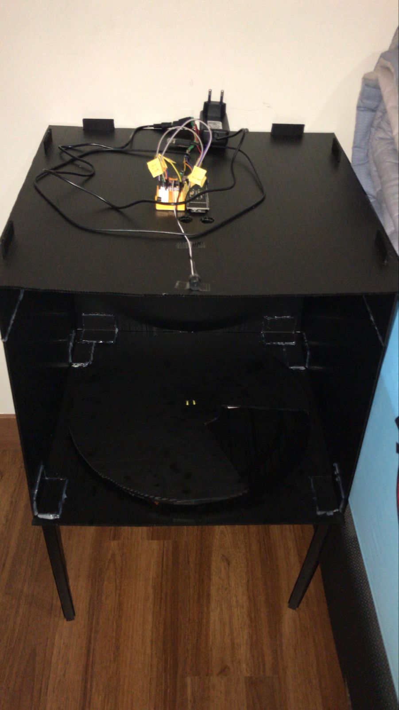
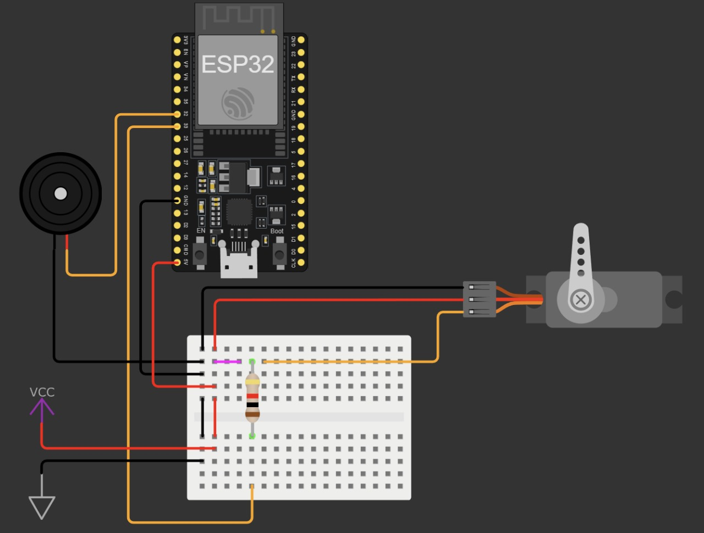
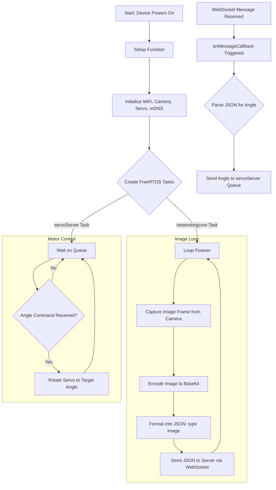
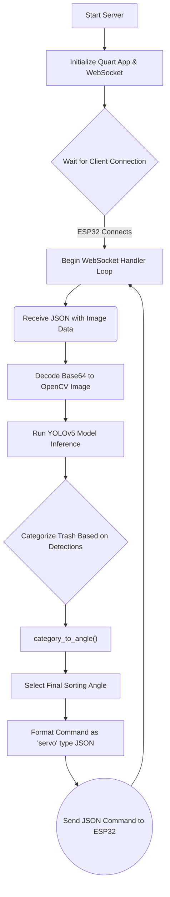
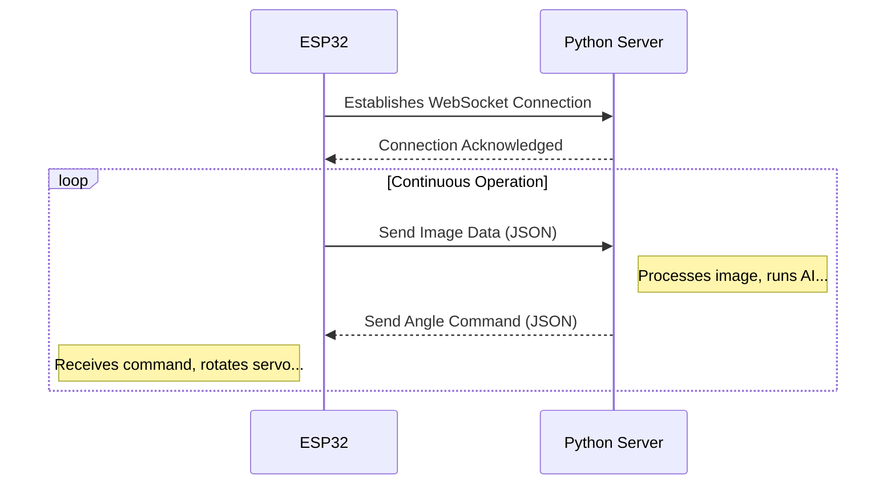

# Golden Trash: AI-Powered Smart Dumpster 🗑️✨

[![Platform][platform-badge]][platform-link]
[![Framework][framework-badge]][framework-link]
[![Language][language-badge]][language-link]
[![Python][python-badge]][python-link]
[![Quart][quart-badge]][quart-link]
[![PyTorch][pytorch-badge]][pytorch-link]
[![YOLOv5][yolo-badge]][yolo-link]

> An intelligent, AI-powered dumpster that automatically sorts trash into different categories. This project leverages an ESP32-CAM for image capture, a YOLOv5 model for real-time inference, and a Python-based WebSocket server to orchestrate the system.

This repository contains all the necessary code for the embedded device (microcontroller) and the backend server, creating a complete, end-to-end solution for automated trash classification and sorting.

-----

### ✨ Key Features

  * **🤖 AI-Powered Sorting:** Utilizes a `YOLOv5` model to automatically classify trash into three categories: **Plastic**, **Degradable**, and **Metal/Electronics**.
  * **📷 Real-Time Image Processing:** An `ESP32-WROVER-E` with an integrated camera captures images of the trash as it's thrown away.
  * **🚀 High-Speed Communication:** Uses `WebSockets` for low-latency communication between the ESP32 and the Python server.
  * **⚙️ Automated Mechanical Sorting:** A `MG90S` servo motor physically directs the trash into the correct container based on the AI's classification.
  * **🌐 Web-Based Monitoring:** A simple web interface allows you to view the live, annotated video stream from the device, showing what the AI is detecting in real-time.
  * **📡 Local Network Discovery:** Implements `mDNS` to allow the ESP32 to discover the server's IP address automatically, simplifying network setup.

-----

## 📸 Showcase

<table align="center">
<tr>
<td align="center">

<br>
<sub><b>Project Showcase</b></sub>
</td>
<td align="center">

<br>
<sub><b>Circuit Scheme</b></sub>
</td>
</tr>
</table>

-----

## 🛠️ Hardware & Software Stack

### Hardware Components

  * **Microcontroller:** ESP32-WROVER-E CAM Devboard
  * **Actuator:** MG90S 360° Continuous Rotation Servo
  * **Feedback:** Piezo Buzzer for audio cues

### Software, Frameworks & Libraries

  * **Platform:** [PlatformIO][platform-link]
  * **Framework:** [Arduino][framework-link]
  * **Server Backend:** [Python][python-link] with [Quart][quart-link] (an ASGI web framework)
  * **AI Model:** [PyTorch][pytorch-link] with [YOLOv5][yolo-link]
  * **Key Libraries:**
      * `ArduinoWebsockets` & `ESP32Servo` for device control.
      * `ArduinoJson` for data serialization.
      * `OpenCV` for image processing on the server.
      * `Zeroconf` for mDNS network service discovery.

-----

## 🏗️ System Architecture

The device operates in a continuous loop to detect and sort trash:

1.  **Image Capture:** The `ESP32-CAM` captures a video stream. It continuously sends frames to the server.
2.  **Data Transmission:** Each frame is Base64 encoded and sent to the Python WebSocket server over the local Wi-Fi network.
3.  **AI Inference:** The server receives the frame, decodes it, and passes it to the `YOLOv5` model for classification.
4.  **Categorization:** The model's output is used to determine the trash category (Plastic, Degradable, etc.). The server then calculates the correct angle for the sorting mechanism.
5.  **Servo Control:** The calculated angle is sent back to the ESP32.
6.  **Sorting:** The ESP32 commands the servo motor to turn to the designated angle, directing the falling trash into the appropriate bin.
7.  **Monitoring:** The server streams the annotated video frames to a web interface, where the user can see the system in action.

<details>
<summary><strong>ESP32 Device Logic</strong></summary>


</details>

<details>
<summary><strong>Python Server Logic</strong></summary>


</details>

<details>
<summary><strong>System Interactions</strong></summary>


</details>


-----

## 🚀 Getting Started

### Prerequisites

1.  Install [Visual Studio Code](https://code.visualstudio.com/).
2.  Install the [PlatformIO IDE extension](https://platformio.org/platformio-ide) in VS Code.
3.  Install [Python 3.8+](https://www.python.org/).
4.  Clone this repository.

### 1. Server Setup (`Python Websocket server/`)

1.  **Navigate to Server Directory:**
    ```bash
    cd "Python Websocket server"
    ```
2.  **Install Dependencies:** It is recommended to use a virtual environment.
    ```bash
    pip install -r requirements.txt
    ```
3.  **Download AI Model:** Download the `yolov5s.pt` model weights from the [YOLOv5 repository][yolo-link] and place it in the server directory.
4.  **Configure Environment:**
      * Create a `.env` file in the server directory.
      * Set the `WEBSOCKET_AND_HTTP_PORT` (e.g., `8756`).
5.  **Firewall Configuration:** Create an inbound rule in your firewall (e.g., Windows Defender Firewall) to allow **TCP** traffic on the port you specified in the `.env` file.
6.  **Run the Server:**
    ```bash
    python main.py
    ```
    Note the server's local IPv4 address by running `ipconfig` (Windows) or `ifconfig`/`ip addr` (Linux/macOS).

### 2. Microcontroller Setup (`Main_AutoTrashcan_Project/`)

1.  **Open Project:** Open the `Main_AutoTrashcan_Project` folder in VS Code with the PlatformIO extension installed.
2.  **Configure Credentials:**
      * Navigate to `lib/conf/conf.h`.
      * Update the following definitions:
          * `WIFI_SSID`: Your Wi-Fi network name.
          * `WIFI_PASSWORD`: Your Wi-Fi password.
          * `SERVER_STATIC_IP`: The IPv4 address of your server from the previous step.
          * `WEBSOCKET_PORT`: The port number from your server's `.env` file.
    > **Note:** The server and the ESP32 must be on the same local network.
3.  **Build and Upload:**
      * Connect your ESP32-WROVER-E device via USB.
      * Use the PlatformIO toolbar (or the command palette `Ctrl+Shift+P`) to:
        1.  **Build** the project (`PlatformIO: Build`).
        2.  **Upload** the firmware to the device (`PlatformIO: Upload`).
4.  **Monitor (Optional):** Open the PlatformIO Serial Monitor (`PlatformIO: Monitor`) to see debug messages and confirm it connects to your server.

### 3. Final Steps

1.  With the Python server running, power on the ESP32 device.
2.  You should hear a beeping sound indicating a successful connection.
3.  Navigate to your server's address in a web browser (e.g., `http://<your-server-ip>:8756`) to view the monitoring interface.
4.  You're all set! The smart dumpster is now operational.

-----

## 📚 Documentation & Demo Video

  * **Full Demo Video (in Indonesian):** [Watch on Google Drive](https://drive.google.com/file/d/1V-xNg7HTjrDbDp9XOzyCG-_occJgqBsg/view?usp=drivesdk)

<!-- Badges -->
[platform-badge]: https://img.shields.io/badge/Platform-PlatformIO-orange.svg
[framework-badge]: https://img.shields.io/badge/Framework-Arduino-00979D.svg
[language-badge]: https://img.shields.io/badge/Language-C%2B%2B-blue.svg
[python-badge]: https://img.shields.io/badge/Python-3776AB.svg?logo=python&logoColor=white
[quart-badge]: https://img.shields.io/badge/Quart-4A92A7.svg
[pytorch-badge]: https://img.shields.io/badge/PyTorch-EE4C2C.svg?logo=pytorch&logoColor=white
[yolo-badge]: https://img.shields.io/badge/YOLOv5-0052C8.svg

<!-- Links -->
[platform-link]: https://platformio.org/
[framework-link]: https://www.arduino.cc/
[language-link]: https://isocpp.org/
[python-link]: https://www.python.org/
[quart-link]: https://quart.palletsprojects.com/
[pytorch-link]: https://pytorch.org/
[yolo-link]: https://github.com/ultralytics/yolov5
